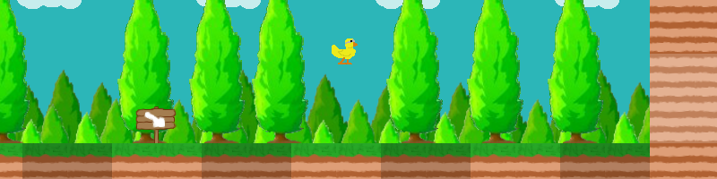

/*! \mainpage The adventures of the masked duck

# The adventures of the masked duck

<h2>Summary:</h2>
<pre>
English version: (by ntome on qt-fr channel on freenode network)
  <a href="#e1">Game presentation: The adventures of the Masked Duck</a>
    <a href="#e1.1">Story</a>
    <a href="#e1.2">Objective</a>
    <a href="#e1.3">Commands</a>
  <a href="#e2">Game editor</a>
  <a href="#e3">Compilation</a>

French version:
  <a href="#f1">Présentation du jeu : Les aventures du Canard Masqué</a>
    <a href="#f1.1">Histoire</a>
    <a href="#f1.2">Objectif</a>
    <a href="#f1.3">Commandes</a>
  <a href="#f2">L'éditeur du jeu</a>
  <a href="#f3">Compilation</a>
</pre>

<a name="e1"><h2>Game presentation: The adventures of the Masked Duck</h2>
 
<a name="e1.1"><h3>Story</h3>
 
<i>It all began on an ordinary sunny day. 
When a duckling cried for help, our hero quickly came to see why she was quacking. 
She said her mother's egg had been stolen! 
While walking around, our hero noticed it wasn't the only egg missing, but the nearby wolf footprints were more alarming. 
So our hero put his Masked Duck suit on to find the stolen eggs, but above all the egg of the mother duck.</i>
 
<a name="e1.2"><h3>Objective</h3>
 
The game objective is to retrieve all the eggs spread around the worlds and avoid the traps put by the wolves.

<a name="e1.3"><h3>Commands</h3>
 
When selecting a world or a step:
<pre>
  Arrow keys: Select world or step.
  Enter: Choose world or step.
  Escape: Show/Hide menu.
</pre>
 
In a level:
<pre>
  Left/Right: Move the Masked Duck.
  Up: Open door.
  Escape: Show/Hide menu.
</pre>
 
In the menu:
<pre>
  Enter: Choose menu option.
  Escape: Hide menu.
</pre>
 
<a name="e2"><h2>Game editor</h2>
 
The game editor allows new worlds to be easily created by generating the necessary code for the world. 
The game dynamically loads libraries that each represent one world, so the generated code must be compiled in order to play this map.
 
<a name="e3"><h2>Compilation</h2>
 
The Qt framework and a C++ compiler toolchain must be installed to compile the project. 
Run the following lines to compile the project:
<pre>
  qmake
  make
</pre>
 
( Under MacOSX, it will be necessary to link in addition to that various libraries between them, see otool / macdeployqt, an automation is in development) 

<a name="f1"><h2>Présentation du jeu : Les aventures du Canard Masqué</h2>

<a name="f1.1"><h3>Histoire</h3>

<i>Tout commence un beau jour ensoleillé comme les autres. 
Quand une jeune canette cria à l'aide, notre héros accourra vers elle pour comprendre la cause de ces cris. 
Elle lui dit que l’œuf de sa mère avait été volé ! 
En inspectant les alentours, notre héros remarqua que ce n'était pas le seul œuf qui avait été volé mais le pire était les traces de loups non loin. 
C'est alors que notre héros pris son costume du Canard Masqué pour retrouver les œufs volés, mais surtout celui de la mère à la jeune canette.</i>

<a name="f1.2"><h3>Objectif</h3>

Le but du jeu est de récupérer tous les œufs éparpillés dans les mondes tout en défiant les pièges des loups.

<a name="f1.3"><h3>Commandes</h3>

Dans la sélection d'un monde ou dans un monde :
<pre>
  Touche directionnelles : Sélectionner le monde ou une étape.
  Entrée : Valider le monde ou une étape.
  Échap : Afficher / Masquer le menu.
</pre>

Dans un niveau :
<pre>
  Gauche / Droite : Déplacer le Canard Masqué.
  Haut : Ouvrir une porte.
  Espace : Sauter.
  Échap : Afficher / Masquer le menu.
</pre>

Dans le menu :
<pre>
  Entrée : Valider l'option du menu.
  Échap : Masquer le menu.
</pre>

<a name="f2"><h2>L'éditeur du jeu</h2>

Cette éditeur permet de créer facilement les mondes pour le jeu, il génère le code nécessaire pour celui-ci. 
Le jeu charge dynamiquement des bibliothèques qui représente chacune un monde, il faut donc compiler le code généré pour le faire fonctionner avec ce dernier.

<a name="f3"><h2>Compilation</h2>

Pour compiler le projet, il faut avoir installer le Framework Qt ainsi que les outils de compilation pour C++. 
Exécuter ces lignes pour compiler le projet:
<pre>
  qmake
  make
</pre>

(Sous MacOSX, il faudra en plus de cela lier les différents bibliothèques entre elles, voir otool / macdeployqt, une automatisation est en cours de codage)
*/
